# Registro de cambios — Web GALE

**Fecha de las observaciones:** 30.05.26
**Documento fuente:** `WEB 30.05.26.pdf`
**Estado:** en progreso

Este documento registra cada cambio aplicado a la web a partir de las observaciones
del cliente, con una captura de pantalla del resultado. Las imágenes viven en
[`./images`](./images).

---

## Resumen de tareas

| # | Sección | Tarea | Estado |
|---|---------|-------|--------|
| T1 | Portada | Subtítulo bajo el título | ✅ |
| T2 | Portada | 3 botones (Cotización · Asesoría · Proyectos) | ✅ |
| T3 | Portada | Indicadores rápidos + presencia | ✅ |
| T4 | Portada | Probar título en azul Gale | 🟡 |
| T5 | Portada | Arreglar "sombra" del texto en celular | ✅ |
| T6 | Portada | Quitar "Existimos para inspirar…" de la portada | ✅ |
| T7 | Proyectos | Subir "Proyectos destacados" a 2.ª sección | ✅ |
| T8 | Proyectos | Renombrar y nueva descripción | ✅ |
| T9 | Proyectos | 5 proyectos destacados con nombre/ubicación | 🟡 |
| T10 | Proyectos | Bug iPad: no se ve la descripción al tocar | ✅ |
| T11 | Servicios | Nueva sección desplegable (4 categorías) | 🟡 |
| T12 | Servicios | Rubros: decisión sobre la flecha | ✅ |
| T13 | Proceso | 5 pasos con nuevos nombres | ✅ |
| T14 | Proceso | Quitar sección de proceso duplicada | ✅ |
| T15 | Proceso | 5.º recurso visual (figura/foto) | 🟡 |
| T16 | Nosotros | Nueva sección (frase azul + filosofía + foto) | ✅ |
| T17 | Testimonios | Agregar 5.º testimonio (Grupo Willy) | 🟡 |
| T18 | Testimonios | Ajustar textos a la versión del cliente | ✅ |
| T19 | Contacto | Nueva frase de cierre | ✅ |
| T20 | Contacto | 3 botones (Correo · Instagram · Agendar) | 🟡 |
| T21 | Pie | Texto del apartado final | ✅ |

Leyenda: ⏳ pendiente · ✅ hecho · 🟡 hecho con nota/decisión pendiente

---

## 1. Portada (T1–T6)

La portada pasó de mostrar solo una frase a ser una verdadera portada de venta:
título, subtítulo, botones de acción e indicadores rápidos, manteniendo el efecto
cinematográfico de la imagen que se contrae al hacer scroll.

**Qué se hizo:**
- **T1 — Subtítulo:** se agregó *"Arquitectura, interiorismo y ejecución de proyectos comerciales, corporativos y residenciales en todo el norte del Perú."*
- **T2 — Botones:** `Solicitar cotización` · `Agendar asesoría` · `Ver proyectos`. Los dos primeros abren WhatsApp con un mensaje precargado; "Ver proyectos" baja a la sección de proyectos. *(Se pueden cambiar a Calendly editando un solo archivo.)*
- **T3 — Indicadores rápidos:** `+50 comerciales`, `+30 residenciales`, `+20 ejecutados`, más la línea de presencia (Jaén, Chiclayo, Trujillo, Lima, Iquitos, Juliaca y más). Se resolvió como una franja editorial, no como el típico bloque de métricas.
- **T5 — "Sombra" en celular:** el título ya **no usa sombra**; ahora se apoya en un degradado oscuro sobre la foto, así que se lee nítido sin el efecto que molestaba.
- **T6 — Se quitó** "Existimos para inspirar / Diseñamos para transformar" de la portada (pasa a la sección Nosotros).
- **T4 — Título en azul:** probado (abajo la comparación). Sobre la foto cálida el azul pierde contraste y se lee mal; se recomienda y se dejó **en blanco**, que era justo la alternativa que planteaba el cliente. Queda a su elección.

**Antes:**

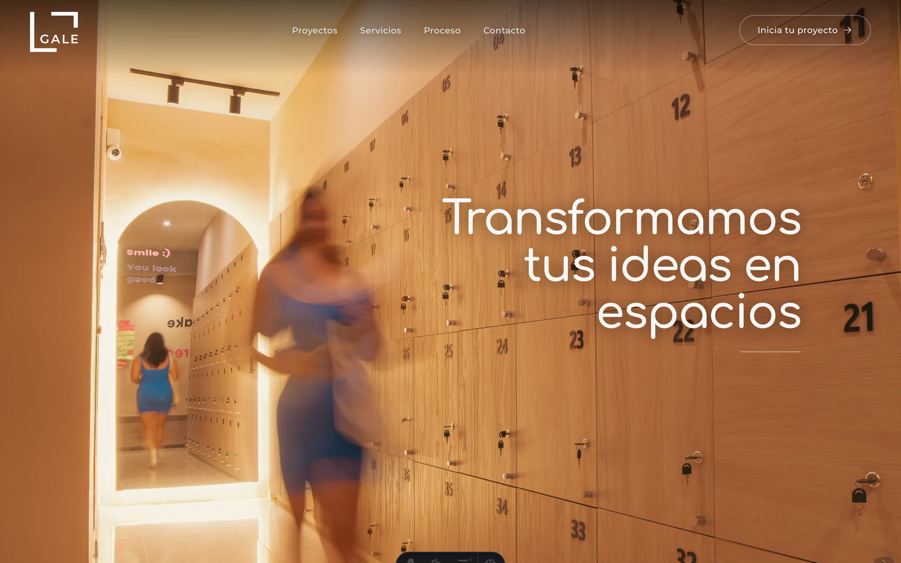

**Después (escritorio):**

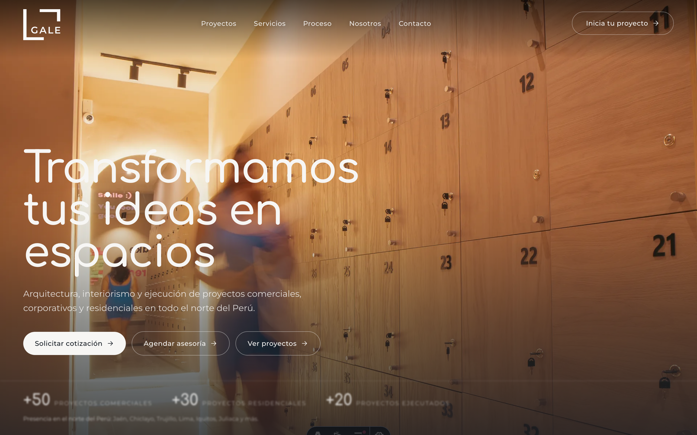

**Después (celular):**

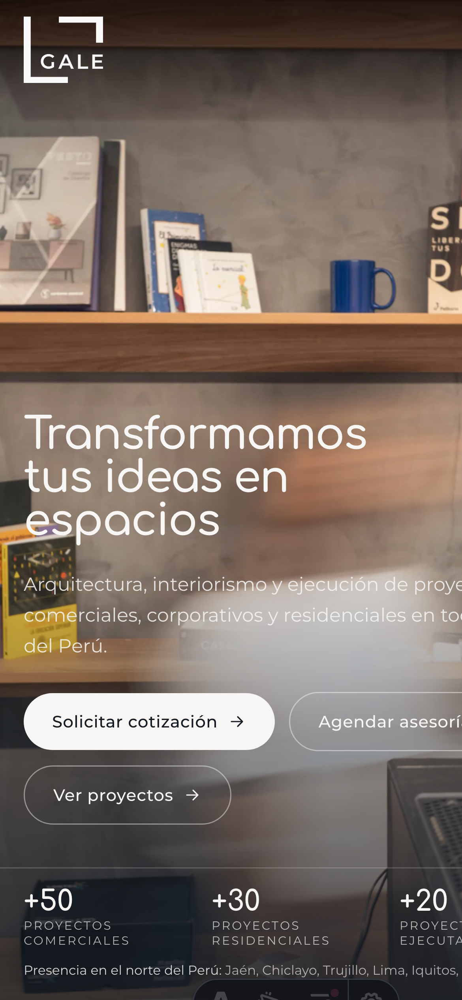

**T4 — Comparación del título en azul (no recomendado por contraste):**

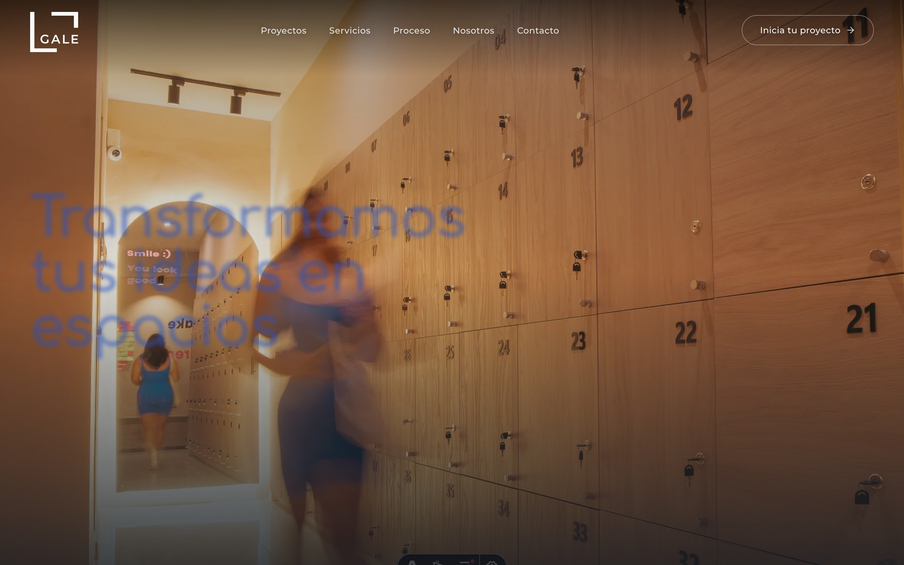

---

## 2. Proyectos destacados (T7–T10)

- **T7 — Se subió** la sección de proyectos al **segundo lugar**, justo después de la portada, como pidió el cliente.
- **T8 — Se renombró** de "Nuestras creaciones más recientes" a **"Proyectos destacados"**, con el nuevo texto: *"Una colección visual de nuestros trabajos. Cada proyecto diseñado de manera personalizada, cuidando la identidad, el propósito y la esencia de cada espacio."*
- **T9 — Los 5 proyectos** quedaron con nombre, tipo y ubicación: Casita del Pan (Panadería y restaurante, Jaén), Maguis Chicken (Restaurante, Neshuya, Pucallpa), Casa Marieta (Residencial, Jaén), COA Ventanilla (Salud, Callao), Finca La Colpa (Turístico, San Ignacio, Cajamarca). *(Ver nota T9 en pendientes: confirmar que la foto de COA corresponda a Ventanilla.)*
- **T10 — Bug del iPad resuelto.** Antes la descripción solo aparecía al pasar el mouse (algo que la tablet no puede hacer). Ahora la web decide por **capacidad de hover**, no por ancho: en escritorio con mouse se mantiene la galería que se expande (la que les gustó); en tablet y celular las tarjetas muestran **siempre** el nombre y la ubicación, y al tocar se abren a pantalla completa.

**Escritorio (galería que se expande al pasar el mouse):**

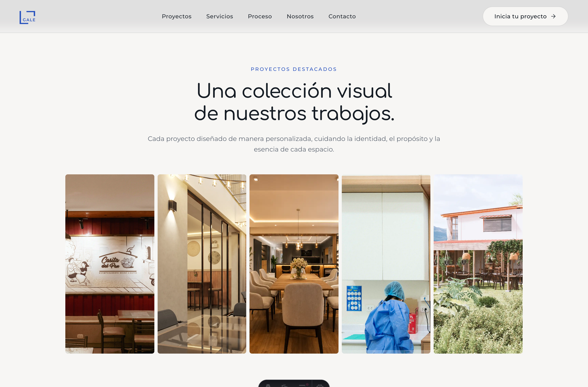

**Tablet / celular (descripción siempre visible — corrige el bug del iPad):**

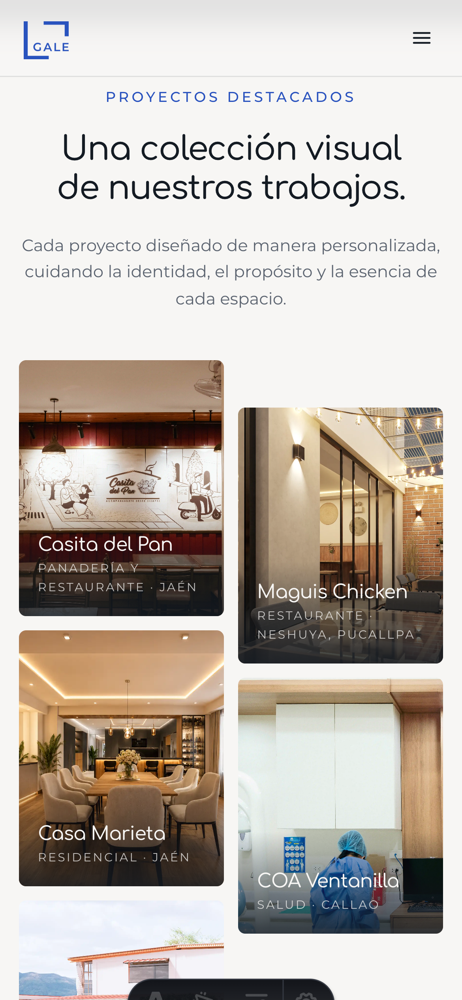

---

## 3. Servicios (T11–T12)

- **T11 — Nueva sección "Servicios"** desplegable, con las 4 categorías y sus ítems: Proyectos integrales, Arquitectura de interiores, Obra y Consultoría. Se resolvió como una **lista editorial que se abre y cierra** (una a la vez, con animación suave), inspirada en las referencias que mandó el cliente, manteniendo la pulcritud. *(Ver nota T11: se puede sumar los "dibujitos"/íconos del estudio cuando los tengamos.)*
- **T12 — Rubros / "la flecha".** La flecha de cada tarjeta sugería un enlace a más trabajos que hoy no existe, así que **se quitó** para no prometer algo que no lleva a ningún lado. Las tarjetas quedan como un índice visual limpio de los rubros. *(Si más adelante hacemos una página de proyectos, las volvemos a enlazar.)*

**Servicios (lista desplegable):**

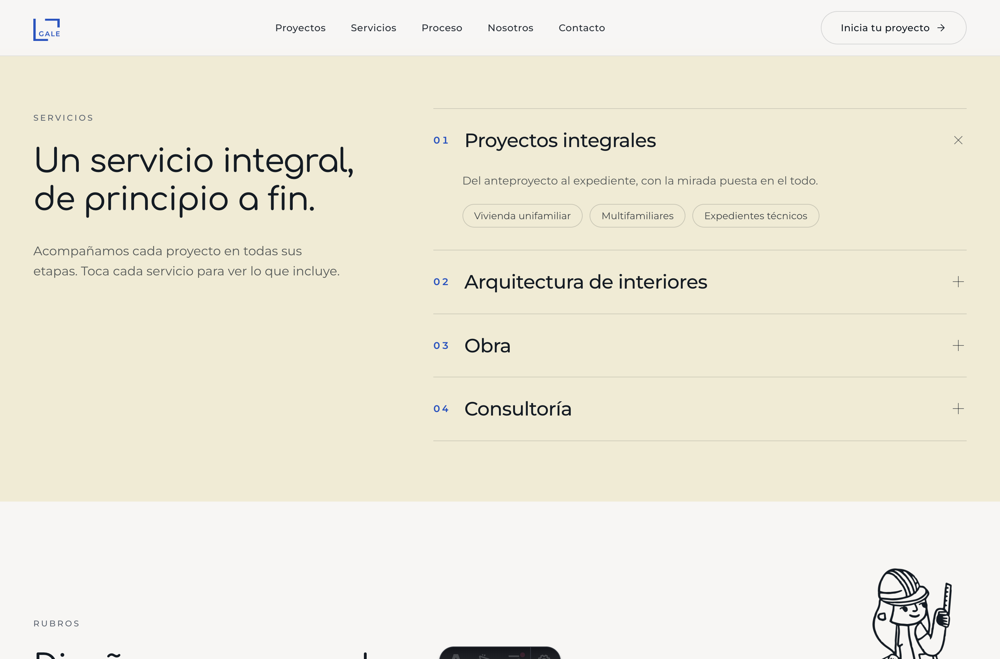

**Rubros (sin la flecha):**

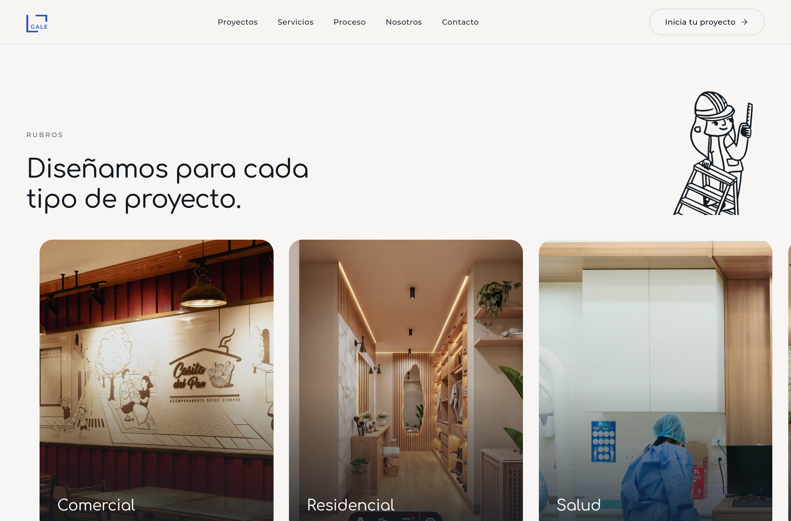

---

## 4. Proceso (T13–T15)

- **T13 — Los 5 pasos** quedaron con los nombres nuevos: Reunión inicial · Levantamiento · Diseño conceptual · Desarrollo técnico · Ejecución y supervisión.
- **T14 — Se quitó** la sección de proceso **duplicada** (había dos; quedó la animada con las figuras que se mueven, que es la que gustó).
- **T15 — Se le dio una imagen propia al 5.º paso** (obra). Las figuras del equipo son solo 4, así que el 5.º paso reutiliza una por ahora. *(Ver pendientes: falta una 5.ª figura/animación.)*

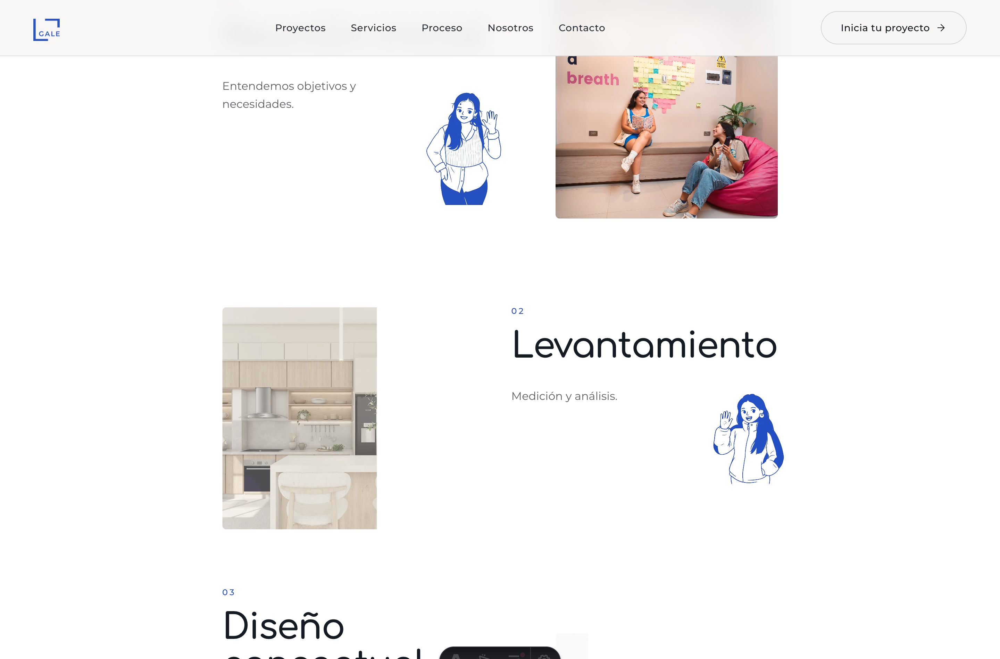

---

## 5. Nosotros (T16)

Sección nueva con la **frase de marca en azul** ("Existimos para inspirar. Diseñamos para transformar."), el texto del estudio, el bloque **"Nuestra filosofía"** y la **foto del equipo (Diana y Luz)** — en la que, además, se lee la misma frase en la pizarra del fondo.

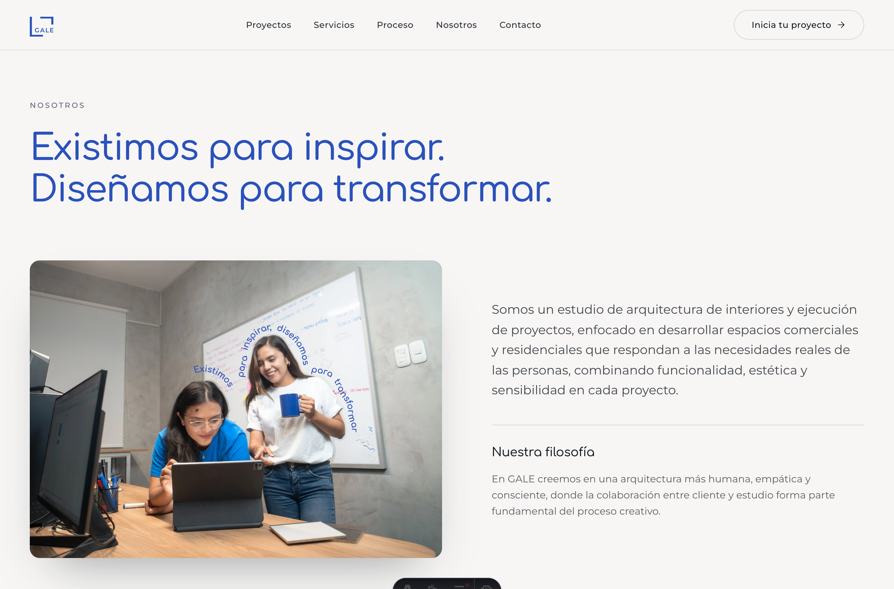

---

## 6. Testimonios (T17–T18)

- **T17 — Se agregó el 5.º testimonio** (Angie Montenegro, Grupo Willy Confecciones). Como aún no tenemos su foto, se muestra un **monograma** ("AM") elegante en azul; al llegar la foto, se reemplaza solo.
- **T18 — Se ajustaron** los textos de los testimonios a la versión del cliente (con una mínima limpieza ortográfica).

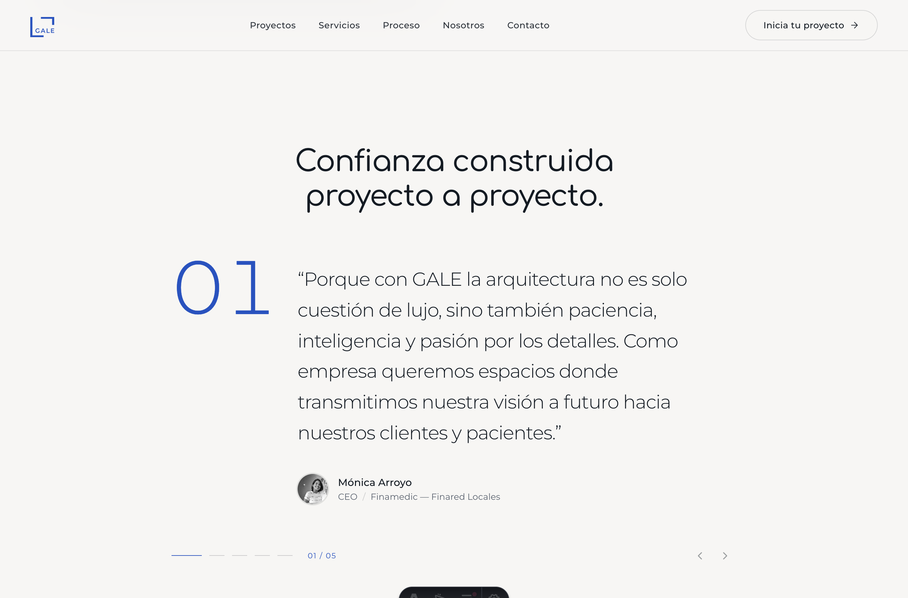

---

## 7. Contacto (T19–T20)

- **T19 — Se agregó** la frase: *"Transformemos tu idea en un espacio funcional, rentable y memorable."*
- **T20 — Los 3 botones**: **Correo** (abre el correo), **Instagram** (abre el perfil) y **Agendar reunión** (abre WhatsApp con un mensaje listo). *(Ver pendientes: si prefieren Calendly para "Agendar", se cambia en un solo lugar.)*

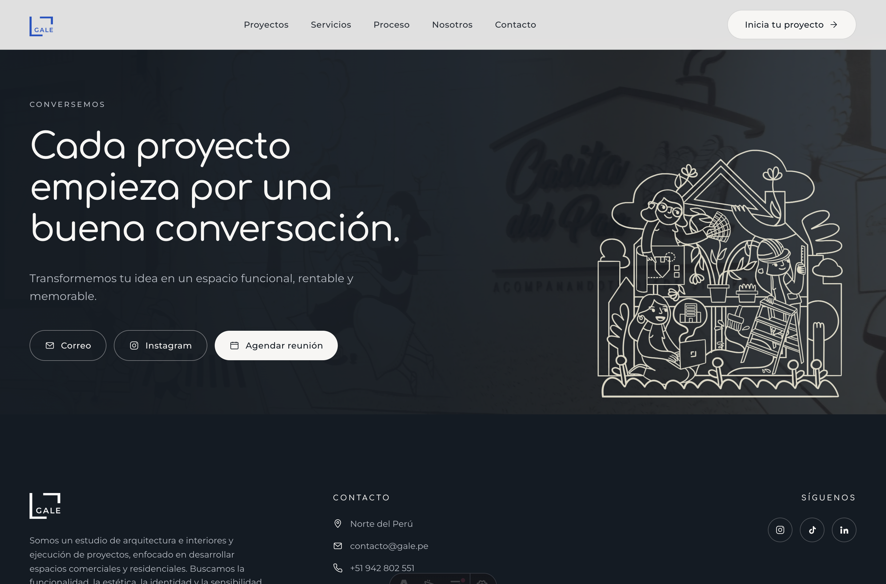

---

## 8. Apartado final / Pie (T21)

Se actualizó el texto del pie a: *"Somos un estudio de arquitectura e interiores y ejecución de proyectos, enfocado en desarrollar espacios comerciales y residenciales. Buscamos la funcionalidad, la estética, la identidad y la sensibilidad en cada proyecto."* (Visible al pie de la captura de Contacto, arriba.)

---

## Decisiones y recursos pendientes

Todo lo del PDF quedó implementado y funcionando. Estos puntos son para afinar
con el cliente; ninguno bloquea la web (todos tienen un valor por defecto que ya
funciona).

**Decisiones (tu visto bueno):**
- **T4 — Color del título de la portada.** Quedó en **blanco** (recomendado por legibilidad sobre la foto). El azul se probó y pierde contraste (comparación en la sección 1). Confirmar.

**Enlaces de botones (hoy con un valor por defecto que funciona):**
- **T2 / T20 — "Solicitar cotización", "Agendar asesoría", "Agendar reunión"** abren **WhatsApp** al `+51 942 802 551` con un mensaje precargado. Si prefieren **Calendly** u otro sistema de reservas, se cambia en un solo lugar: el objeto `links` en `src/data/site.ts`.

**Recursos/fotos que faltan (mientras tanto hay un buen reemplazo):**
- **T9 — COA Ventanilla.** El cliente la ubica en Callao, pero la foto está en una carpeta llamada `salud-coa-jaen`. Confirmar que la imagen corresponda al proyecto de Ventanilla.
- **T11 — Íconos de Servicios.** La lista va con numeración (01–04), limpia y sin íconos. Si quieren sumar los "dibujitos" del estudio, se integran a cada categoría.
- **T15 — 5.ª figura del proceso.** Hay 4 figuras del equipo; el 5.º paso reutiliza una. Idealmente, una 5.ª figura/animación.
- **T17 — Foto de Angie Montenegro** (Grupo Willy). Hoy se muestra un monograma "AM"; al enviar la foto se reemplaza automáticamente.

**Notas técnicas (para el equipo de desarrollo):**
- Toda la copia y los enlaces viven en `src/data/site.ts` (fuente única).
- El orden de la página y los anclajes (`#proyectos`, `#servicios`, `#proceso`, `#nosotros`, `#contacto`, `#rubros`, `#testimonios`) ya están alineados con el nuevo menú.
- Quedaron sin uso en la página (no se borraron): `Process.astro`, `ImageMosaic.astro`, `Hero.astro`, `LogoReveal.astro`, `ProjectsGrid.astro`, `FeatureSplit.astro`.
- `bun run build` compila sin errores.
